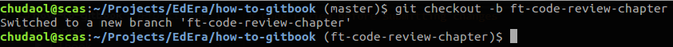
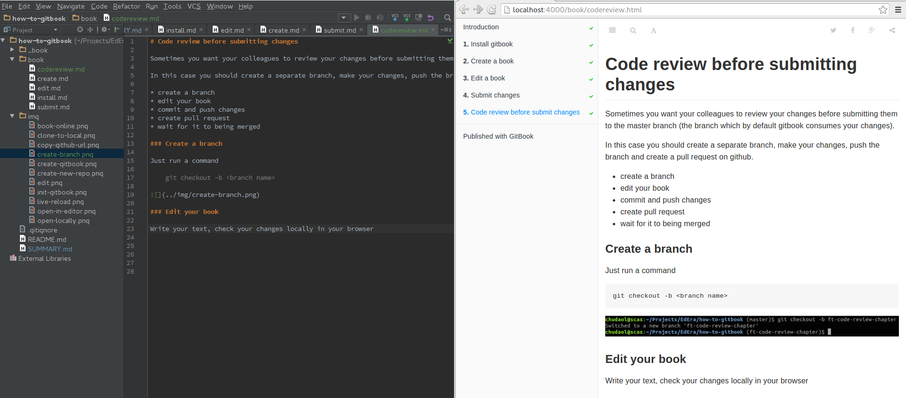
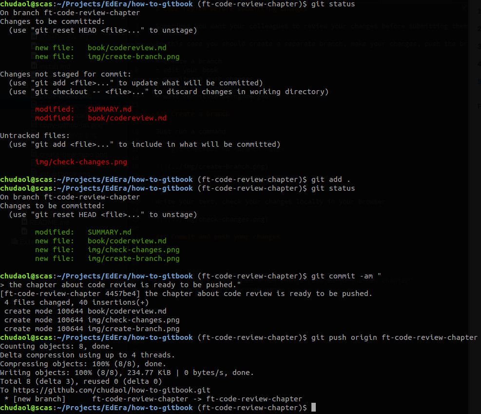
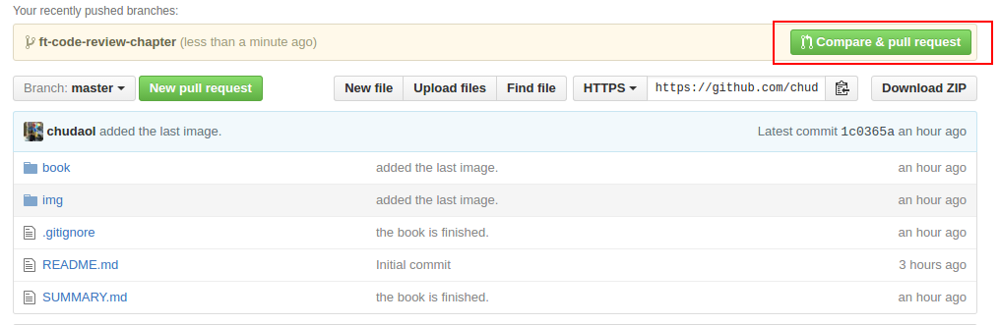
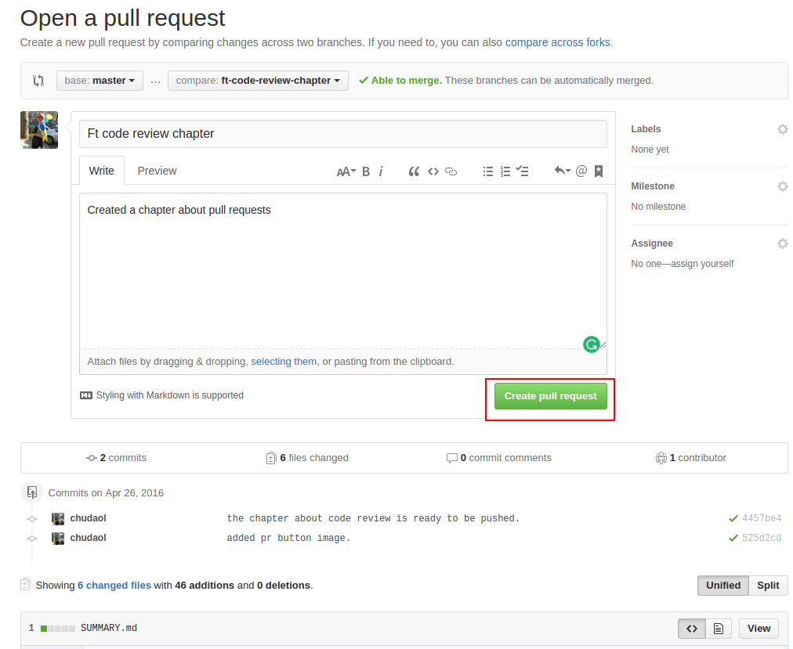
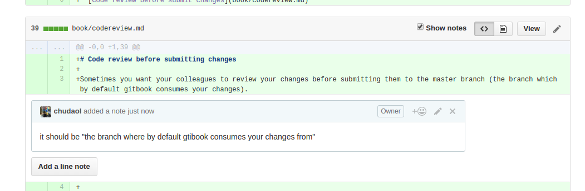
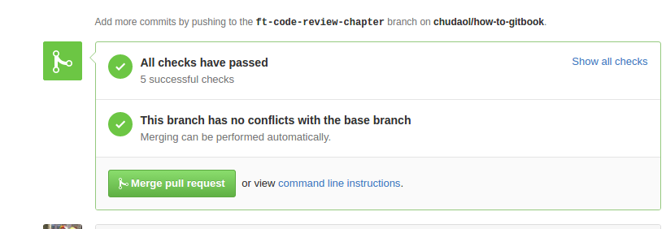

# Code review before submitting changes

Sometimes you want your colleagues to review your changes before submitting them to the master branch (the branch which by default gitbook consumes your changes).

In this case you should create a separate branch, make your changes, push the branch and create a pull request on github.

* create a branch
* edit your book
* commit and push changes
* create pull request
* Being a reviewer
* wait for it to being merged

### Create a branch

Just run a command

    git checkout -b <branch name>
    

### Edit your book

Write your text, check your changes locally in your browser

### Commit and push your changes

Run

    git add .
    git commit -am "Added a new change related to the new chapter"
    git push origin <branch name>
    

### Create pull request

Go to your github page and click on Compare & pull request button:

Check your changes and click on Create pull request button:

Now wait for comments from your collegues and repeat the process of editing and resubmitting until your branch is finally merged.

### Being a reviewer

If you received a pull request from your colleague, go through it and comment on what you think should be changed:
 

After all asked changes being implemented you can finally merge pull request:

### Wait for your branch being merged

