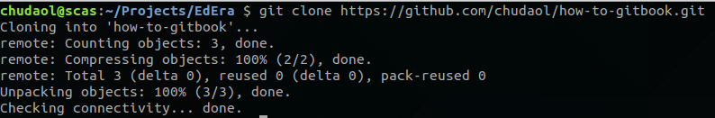

# How to create your book using git

* Create a repository on github
* Check it out locally
* Run gitbook init
* Commit and push your changes
* Create a gitbook on your gitbook space

### Create a repository on github

### Check it out locally

Copy github repository's URL:

Clone it on your machine:

    git clone <github url>
    

### Run gitbook init

cd to your book's directory and run gitbook init:

    gitbook init
    

### Commit and push your changes

cd to your book's directory and run

    git add .
    git commit -am "created gitbook structure"
    git push origin master
    
### Create a gitbook on your gitbook space

Go to your gitbook space, click on New Book button, choose github tab and choose your new github repository:

Yes! You are done!

