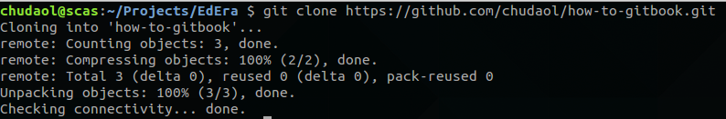
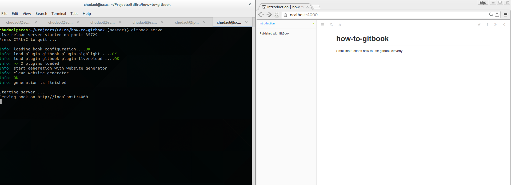
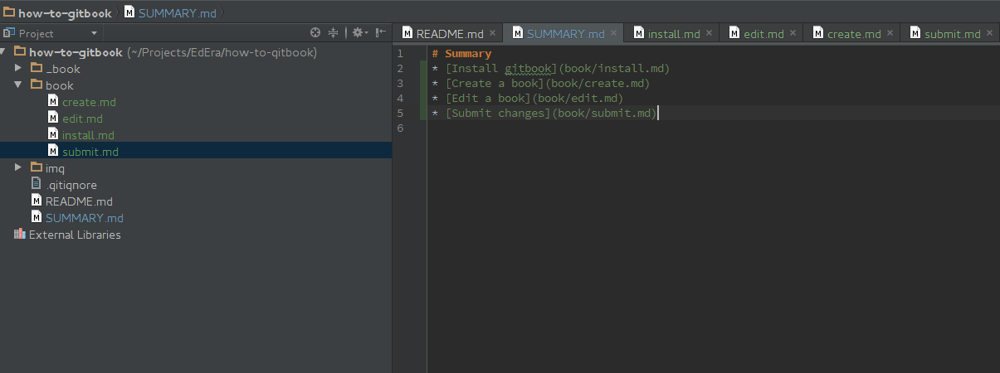
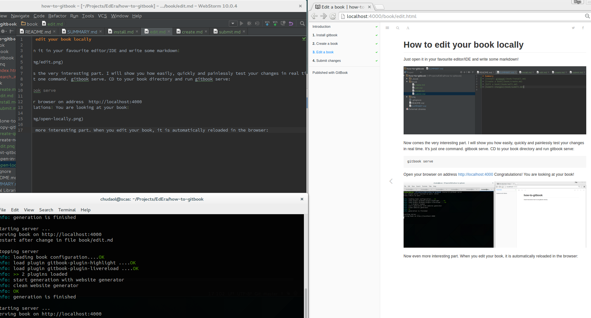

# How to edit your book locally

* Install gitbook
* Clone the repository
* Run gitbook install 
* Run gitbook serve
* Edit and check

### Install gitbook

If you haven't installed gitbook already, make sure you have nodeJS installed and then run
                                              
    npm install gitbook-cli -g
    
For more detailed instructions check out this page [here](https://github.com/GitbookIO/gitbook/blob/master/docs/setup.md).    
    
### Clone the repository
    
If you still haven't cloned the book's repository, clone it:
    
    git clone <repository URL>
    

    
### Run gitbook install
    
Inside book's directory run:
    
    gitbook install
    
### Run gitbook serve
    
Inside book's directory run:
    
    gitbook serve
    
And open your browser on address http://localhost:4000

### Edit and check

Just open it in your favourite editor/IDE and write some markdown!

Now comes the very interesting part. I will show you how easily, quickly and painlessly test your changes in real time.

It's just one command. *gitbook serve*. You've already run it and you have your book opened in a browser.

Now even more interesting part. When you edit your book, it is automatically reloaded in the browser:

Write your book, add your images, do whatever you want locally. Don't suffer of the slowness of the online editor!
 
For how-to submit your changes check the next chapter.