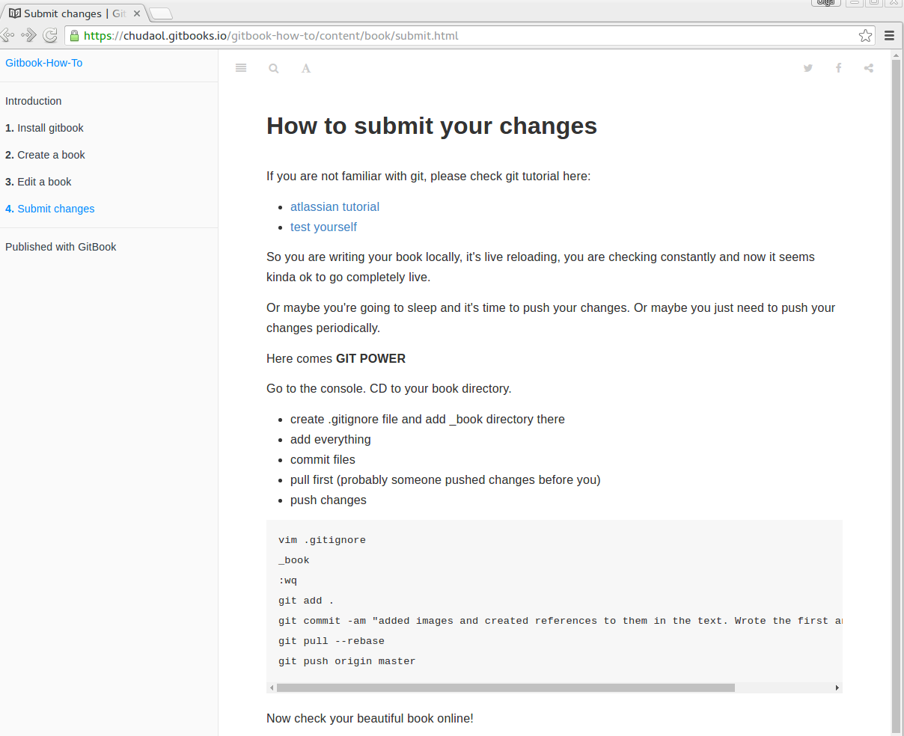

# How to submit your changes

If you are not familiar with git, please check git tutorial here:

* [atlassian tutorial](https://www.atlassian.com/git/tutorials/)
* [test yourself](https://try.github.io/levels/1/challenges/1)

So you are writing your book locally, it's live reloading, you are checking constantly and now it seems kinda ok to go completely live.

Or maybe you're going to sleep and it's time to push your changes. Or maybe you just need to push your changes periodically.

Here comes **GIT POWER**

Go to the console. CD to your book directory. 

* create .gitignore file and add _book directory there
* add everything
* commit files
* pull first (probably someone pushed changes before you)
* push changes

    vim .gitignore
    _book
    :wq
    git add .
    git commit -am "added images and created references to them in the text. Wrote the first and second chapter"
    git pull --rebase
    git push origin master
    
Now check your beautiful book online!

    

